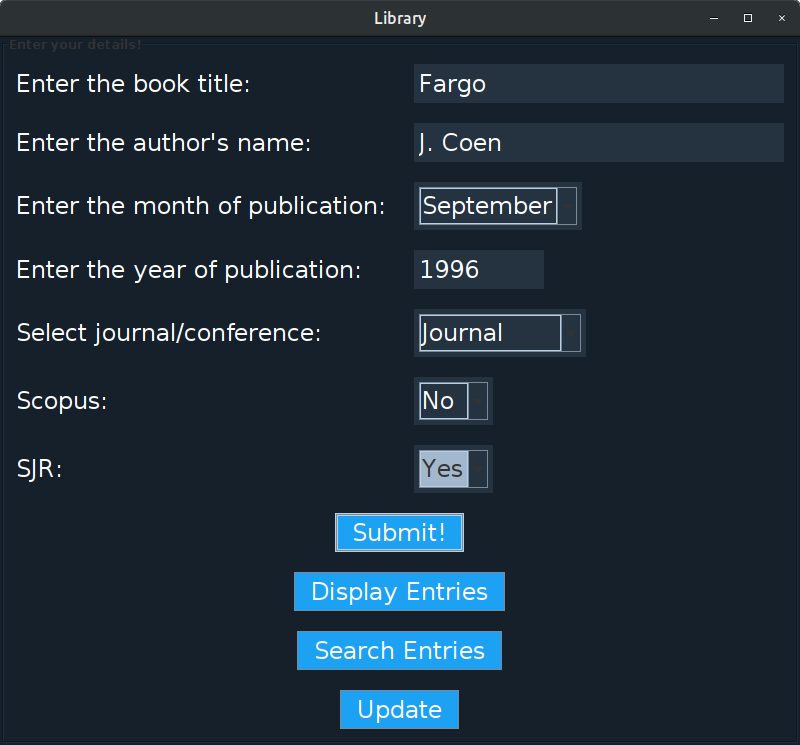

# 
Book Catalogue

A Java-based application which stores information regarding books in a MySQL database. 
 

***
### _Contributors:_
* Amarthya Ravi, [Amarthya03](https://github.com/Amarthya03)
* Amit Vasudev, [timaddg](https://github.com/timaddg)
* Anirudh Dutt, [Pandani07](https://github.com/Pandani07)   
Ramaiah Institute of Technology

### _Assigned by:_
* Dr. Sumana Maradithaya, (Ramaiah Institute of Technology)
